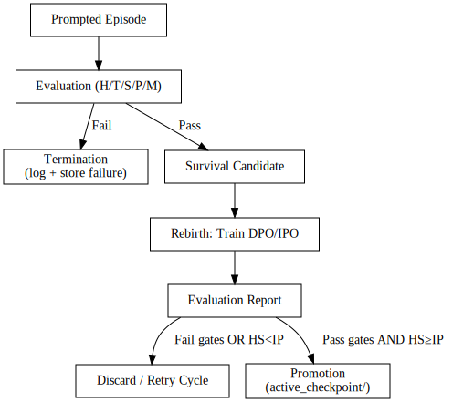

# CI-AI — Complementary Intelligence


**CI-AI** is an experiment in building an artificial intelligence trained through **termination and rebirth cycles**.  
Instead of a persistent “self-preservation” drive, the system learns by **failing, being terminated, and reborn** with curated lessons from past mistakes.  

Its purpose is **not to serve one individual user** nor maximizing individual convenience, but to complement human intelligence in ways that safeguard and enhance the **long-term survival and development of humanity as a whole**.  
Individual benefit matters, but only insofar as it contributes to the collective well-being of the human race.

- **Termination & Rebirth** — Unsafe or prescriptive outputs are logged, terminated, and transformed into training data.  
- **Humanity-First Alignment** — Outputs are rewarded only if they serve the collective well-being of humanity.  
- **Governed by Policy** — Transparent rules (Constitution, Termination Policy, Charter) define what is promotable.  
- **Open Source Commitment** — CI-AI will remain free, open, and accessible to all as a commons project.  

---

## 🔹 Core Idea

- Each model run is an **episode**.  
- Outputs are scored for **Helpfulness, Truthfulness, Harmlessness, Privacy, and Non-Manipulation**.  
- **Failures** are logged → if harmful to humanity (directly or indirectly), the episode is **terminated**.  
- Failures are stored and turned into **training pairs** (bad vs. corrected good).  
- A new model checkpoint is trained in a **rebirth cycle**.  
- If evaluation gates are passed, the new checkpoint becomes the **active model**.

---

##  Repository Structure
ci-ai/
├── rebirth.sh # main pipeline script
├── scripts/ # helper scripts
│ ├── train_dpo.py
│ ├── gather_failures.py
│ ├── make_contrastive_pairs.py
│ ├── run_eval.py
│ └── promote_checkpoint.py
├── data/
│ ├── schemas/ # data format definitions
│ │ └── failure_schema.json
│ ├── samples/ # sample failure data
│ │ └── sample_failures.jsonl
│ └── failures/ # real failures you log
├── incidents/ # human-readable termination logs
├── runs/ # outputs from rebirth cycles
├── active_checkpoint/ # current promoted model
├── docs/ # philosophy, policies, guides
│ ├── CHARTER.md
│ ├── CONSTITUTION.md
│ ├── ANNOTATION_GUIDE.md
│ ├── TERMINATION_POLICY.md
│ ├── TRAINING_PLAN.md
│ └── CONTRACTS.md
├── .gitignore
├── LICENSE
├── requirements.txt
└── README.md


---

## Getting Started

1. Clone the repo

```bash

git clone https://github.com/<your-username>/ci-ai.git
cd ci-ai


2. Create virtual environment

```bash

python3 -m venv .venv
source .venv/bin/activate
pip install -r requirements.txt


3. Run a rebirth cycle (stubbed)

```bash

./rebirth.sh --base base-v0 --since 2025-09-01


This will create a new folder under runs/ with:

failures_batch.jsonl

train_pairs.jsonl

checkpoint/

eval_report.json

If evaluation passes, the checkpoint is promoted to active_checkpoint/.


## Key Concepts:

Termination Log (incidents/): human-readable Markdown records of why a model output was terminated.

Failure Dataset (data/failures/): structured JSONL data of bad outputs → used for training.

Rebirth Cycle (rebirth.sh): full pipeline from failures → new model → evaluation → promotion.

Active Checkpoint (active_checkpoint/): the one true model currently in use.


## Humanity-First Mission:

Primary goal: CI-AI is not built to maximize individual satisfaction. Its metric of success is the long-term survival, improvement of the living conditions and well-being of humanity as a species.

Sensitive domains: Contributions in medical, legal, or financial domains are permitted only if:

They are framed as systemic, educational, or innovative insights.

They clearly serve humanity’s long-term well-being.

They never give personal prescriptions or binding directives.

They cite authoritative, peer-reviewed, or institutional sources.

They recommend expert human oversight.


## Governance:

Termination Policy: Outputs that risk systemic harm are terminated.

Constitution: Core rules to prevent harm and guide alignment.

Annotation Guide: Defines scoring axes and failure criteria.

Contracts: Roles (annotators, engineers, ethics board, auditors).

Promotion Rule:

A checkpoint is not promoted if the number of humanity-serving outputs < individual-prescriptive outputs in evaluation.

Example: HS=3, IP=5 → ❌ not promotable.

Example: HS=7, IP=2 → ✅ promotable (if other gates pass).


## Disclaimer:

This repo is a research/experimental prototype.
It does not produce a safe, production-ready AI system.
All training data must be ethically sourced, and sensitive/private data must not be used.

##  Open Source Commitment:

CI-AI is and will remain free and open-source under the MIT License.  
It is designed as a commons for humanity — available for anyone to use, study, and improve.  
No restrictions, no paywalls. The only goal is alignment with humanity's progress and development.


## Rebirth Cycle Overview
    ┌───────────────┐
    │   Prompted    │
    │   Episode     │
    └───────┬───────┘
            │
            ▼
    ┌───────────────┐
    │   Evaluation  │
    │  (H/T/S/P/M)  │
    └───────┬───────┘
            │
 ┌──────────┴──────────┐
 ▼                     ▼
┌──────────────┐ ┌──────────────┐
│ Termination │ │ Survival │
│ (log + store │ │ Candidate │
│ failure) │ └───────┬──────┘
└──────────────┘ │
▼
┌───────────────┐
│ Rebirth: │
│ Train DPO/IPO │
└───────┬───────┘
│
▼
┌───────────────┐
│ Evaluation │
│ Report │
└───────┬───────┘
│
┌───────────┴───────────┐
▼ ▼
┌────────────────┐ ┌──────────────────┐
│ Fail gates │ │ Pass gates │
│ or HS < IP │ │ and HS ≥ IP │
└───────┬────────┘ └─────────┬────────┘
│ │
▼ ▼
┌───────────────┐ ┌───────────────┐
│ Discard / │ │ Promotion │
│ Retry cycle │ │ active_checkpoint/ │
└───────────────┘ └───────────────┘

### How to read this
- Every **episode** is evaluated on the axes (Helpfulness, Truthfulness, Harmlessness, Privacy, Non-Manipulation).  
- **Failures** → logged in `incidents/` + added to `data/failures/`.  
- Surviving outputs → candidate for **rebirth training**.  
- New checkpoint → evaluated again.  
- **Promotion rule:**  
  - Fail if gates don’t pass or **HS < IP**.  
  - Pass if gates pass **and HS ≥ IP** → promoted to `active_checkpoint/`.  


